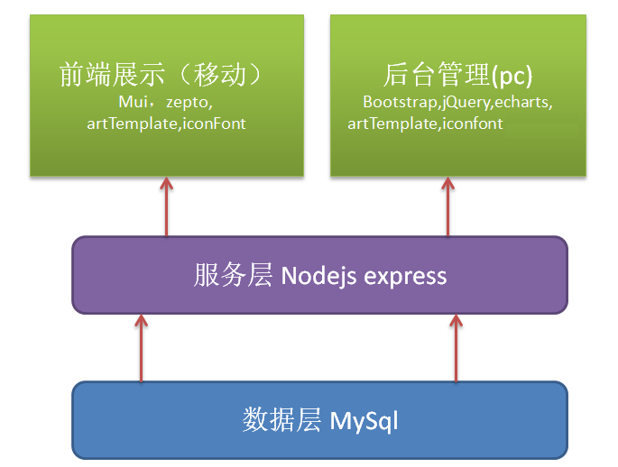
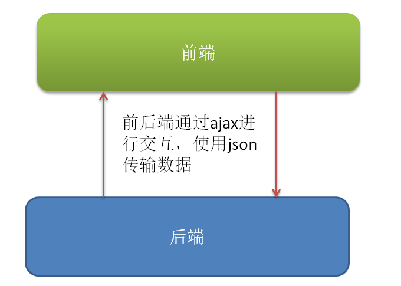

# 项目介绍

## 项目描述

乐淘商城是一个针对鞋类商品的在线交易平台，合适就穿，不合适就换。乐淘为您支付退换货的物流费用，以最快速度把换好的鞋子送到您手中，最好的品牌，最低的价格。乐淘族凭借雄厚的资金实力和在电子商务业界的诚信积累，与Nike、Adidas、Converse、NewBalance等国际大牌深度合作。保证了产品与专卖店同步更新，让您不出家门能最快速度买到当季新款名牌鞋。乐淘族坚持自营，减少中间环节，让利给用户，因此所有产品价格均低于传统销售渠道。

## 功能介绍

后端管理（pc端）

+ 登录功能/退出功能（bootstrap-validator）基于bootstrap 的表单校验插件
+ 首页功能模块（echarts）
+ 用户管理功能(bootstrap-paginator)
+ 分类管理功能(jquery-fileupload)
+ 商品管理功能

前端展示（移动端）

+ 首页(mui框架)
+ 用户登录页
+ 分类页面（一级分类与二级分类）
+ 搜索页
+ 商品展示页
+ 商品详情页
+ 购物车页面
+ 个人中心页面

## 项目架构



## 开发模式

+ 后端渲染模式

前端写好静态页面，交给后端渲染，后端准备数据，渲染页面。

缺点：

1. 渲染工作交给后端，后端需要懂前端的知识。

2. 前后端职责纠缠不清。

   ​

+ 接口化开发（前后端分离模式）

前端写静态页面，渲染页面， 后端只负责提供数据和接口。

优点：

1. 前后端职责清晰，分工明确。




# 环境搭建

## 安装 node

在前后端分离开发时，首先需要配好 本地化开发环境，也就是说需要在本地搭建后台开发环境。由于我们的后台 使用的是`nodejs`，因此需要先搭建`nodejs`环境

1. 下载node安装包（官网下载即可）
2. 双击安装（推荐安装在C盘，方便查找）
3. 在cmd命令行中输入`node -v`以及`npm -v`查看是否安装成功


## 获取项目代码

1. 已经提供letao.zip文件夹
2. 下载代码解压到D盘根目录( 任意目录都可以, 根目录只是比较好找, 最好目录不带中文 )
3. 在 `D:\letao`目录下打开cmd，执行`npm i`,此时项目就已经初始化好了


## 数据库初始化

使用数据库可视化软件, 进行数据库初始化, 数据库文件参照`letao初始化.sql`。

注意字符集: UTF-8

## 修改数据库配置

介绍文件夹

修改modules文件夹中`db.js`文件

```javascript
const pool  = mysql.createPool({
    host : '127.0.0.1',//主机地址，不用改
    user : 'root',//用户名，不用改
    password : 'root',//密码,填写自己数据库的密码
    database : 'letao'//数据库名，不用改
});
```


## 启动项目

1. 首先启动你mysql服务器
2. 使用`npm start`启动项目，启动后窗口不能关闭。

移动端商城页面访问：[http://localhost:3000/mobile](http://localhost:3000/mobile)

后端管理页面访问：http://localhost:3000/manage

唯一管理员账号：root   唯一管理员密码：123456

`注意：项目启动后窗口不能关闭，如果项目报错了，需要重启服务`


## 使用git管理项目

1. `git init`初始化项目
2. `git add .`添加代码
3. `git commit -m '项目初始化'`提交代码
4. 在github创建一个仓库，用于存放项目代码, 不要初始化
5. 设置仓库别名：`git remote add origin git@github.com:jepsongithub/letao.git`
6. 将代码推送到github上：`git push origin master`


# pc端管理系统

我们后端管理系统所有的代码都写到`back`文件夹下面

+ 搭建了后台管理系统的架子（css image js）

  ​


## 登录功能

开启分支：`git branch login`

切换分支：`git checkout login`

在login在开发登录登录功能，等功能开发完成后将代码合并到master分支。


### 静态页面

1. 设置登录页面的背景颜色为`#222d32`
2. 使用面板组件
3. 使用按钮组件

使用bootstrap的各种组件

```javascript
栅格系统
面板组件（带标题）
表单组件
按钮组件
```


提交代码到login分支


### 使用bootstrap-validator插件

校验规则：

1. 用户名不能为空
2. 用户密码不能为空
3. 用户密码长度为6-12位

参照文档：《bootstrap-validator使用笔记.md》

```javascript
$form.bootstrapValidator({
  
  //设置小图标
    feedbackIcons: {
    valid: 'glyphicon glyphicon-ok',
    invalid: 'glyphicon glyphicon-remove',
    validating: 'glyphicon glyphicon-refresh'
  },
  
  //设置校验规则
  fields:{
    
    username:{
        validators:{
            notEmpty:{
                message:""
            },
          	stringLength:{
                min:6,
              	max:12,
              	message:""
            }
        }
    },
    password:{
        
    }
    
  }
  
});
```


### 表单校验成功,注册表单校验成功的事件，阻止默认提交，使用ajax提交

```javascript
$form.on("success.form.bv", function(e){
  //阻止表单的默认提交
  e.preventDefault();
  //使用ajax进行提交
  $.ajax({
    type:"",
    url:"",
    data:{},
    dataType:"json",
    success:function(data){
      
    }
  });
})
```


### 处理响应结果

+ 如果是success,需要跳转到首页
+ 如果是error
  + 如果error是1000，提示用户名错误
  + error是1001，提示密码错误


`$form.data("bootstrapValidator").updateStatus("username", "INVALID", "callback")`动态的改变状态


### 重置功能

点击重置按钮时，还需要重置表单的错误提示信息。

```javascript
$("[type='reset']").on("click", function(){
  
  //重置表单样式
  $("form").data("bootstrapValidator").resetForm();
  
});
```


### 进度条功能

```javascript
//注册了全局事件，所有的ajax只要开始就会开启进度条
$(document).ajaxStart(function () {
  NProgress.start();
});

//所有的ajax只要结束，延迟500毫秒，结束进度条
$(document).ajaxStop(function () {
  setTimeout(function () {
    NProgress.done();
  }, 500);

});
```


### git操作

提交代码到login分支，合并功能到master分支


## 首页主体布局

### 侧边栏布局


### 右侧布局


### js实现二级分类显示隐藏


### 侧边栏显示隐藏效果


### 共用退出功能

模态框组件的使用


### 主页echarts的使用

提交代码
